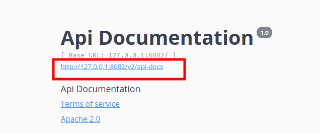
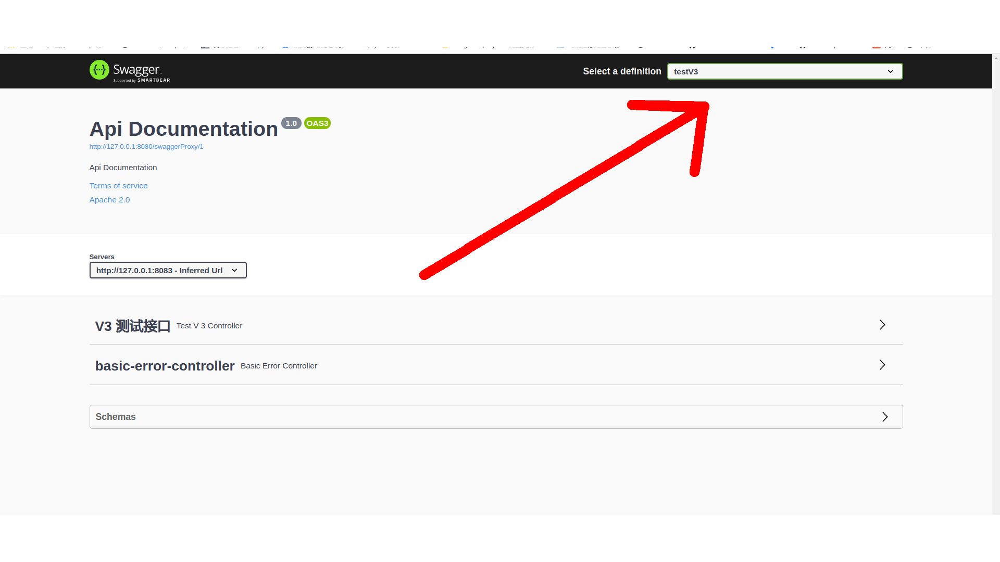
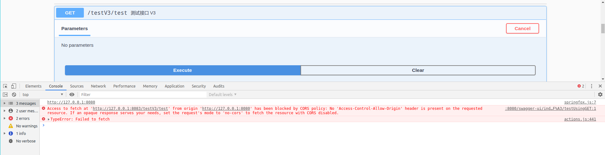

# swagger-aggregate

swagger 聚合工具

## 使用教程

1. 配置需要代理服务

|名称|备注|
|---|---|
|swagger-aggregate.resources.name|代理服务名称|
|swagger-aggregate.resources.url|代理服务 api 地址|
|swagger-aggregate.resources.version|代理服务swagger版本|

代理服务 api 地址:



配置文件参考:

swagger-aggregate-web/crc/main/resource/application.yml

```yaml
swagger-aggregate:
  resources:
    - name: testV2
      url: http://127.0.0.1:8082/v2/api-docs
      version: 2.0
    - name: testV3
      url: http://127.0.0.1:8083/v3/api-docs
      version: 3.0.3
```

## 2. 运行测试

1. 启动 `swagger-test-v2`, `swagger-test-v3` 和 `swagger-aggregate-web`

2. 打开地址 [http://127.0.0.1:8080/swagger-ui/index.html](http://127.0.0.1:8080/swagger-ui/index.html)

3. 切换swagger文档



4. 注意: 如果想在代理文档中进行接口测试，被测试的服务需要开启跨域支持，或将其与 swagger 代理服务放在同一域名下，否则有跨域问题


